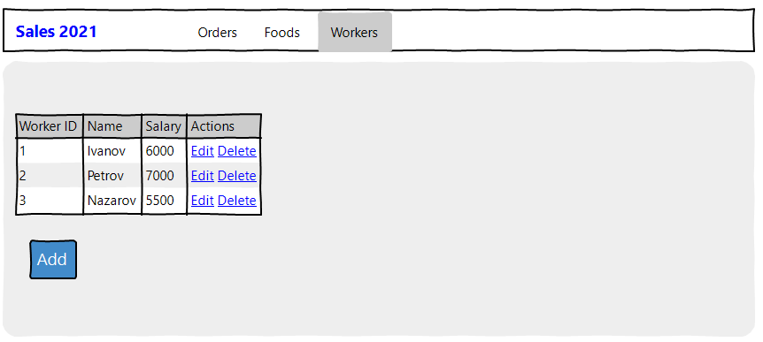
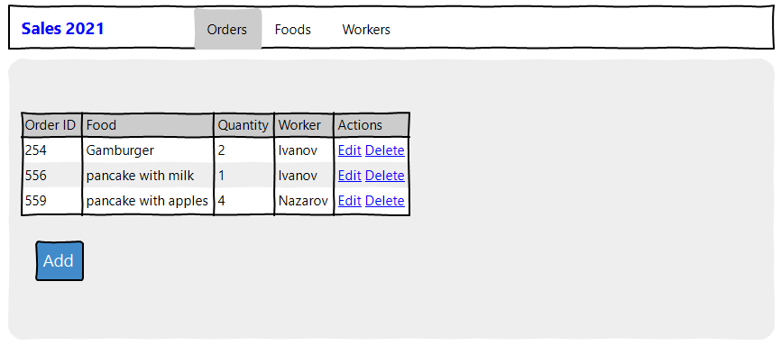

# Sales 2021

## Vision

"Sales 2021" is webservice (webapplication) which allows users to record information about sales of food in snack bars.

Application should provide:
- storing kind of foods, workers and orders in a database;
- Display list of foods;
- Updating the list of foods (adding, editing, removing);
- Display list of workers;
- Updating the list of workers (adding, editing, removing);
- Display list of orders;
- Updating the list of orders (adding, editing, removing);

## 1. Foods
### 1.1 Display list of foods
The mode is designed to view the list of foods

*Main scenario:*
- User selects menu items "Foods"
- Application displays list of Foods
  
  

The list displays the following columns:
- ID 
- Food name
- Price
- Actions

### 1.2 Add food
*Main scenario:*
- User clicks the "Add" button in the food list view mode;
- Application displays form to enter food data;
- User enters food data and presses "Save" button;
- If entered data is valid, then record is adding to database and then list of foods with added records is displaying;
- If entered data is invalid, incorrect data messages are displayed;
- This is button "Cancel" that can interrupt operation of adding new food.
### 1.3 Edit food
*Main scenario:*
- User clicks the "Edit" button in the food list view mode;
- Application displays form to edit food data;
- User enters food data and presses "Save" button;
- If entered data is valid, then record is adding to database and then list of foods with added records is displaying;
- If entered data is invalid, incorrect data messages are displayed;
- This is button "Cancel" that can interrupt operation of adding new food.

### 1.4 Removing the food
*Main scenario:*
- User clicks the "Delete" button in the food list view mode;
- Application displays confirmation form to remove food data;
- If user confirms the removal of the food (click 'Yes') then record is deleted from database;
- This is button "Cancel" that can interrupt operation of adding new food.

## 2. Workers
### 2.1 Display list of workers
The mode is designed to view the list of workers

*Main scenario:*
- User selects menu items "Workers"
- Application displays list of Workers
  
  

The list displays the following columns:
- ID 
- Name
- Salary
- Actions
### 2.2 Add worker
*Main scenario:*
- User clicks the "Add" button in the worker list view mode;
- Application displays form to enter worker data;
- User enters worker data and presses "Save" button;
- If entered data is valid, then record is adding to database and then list of workers with added records is displaying;
- If entered data is invalid, incorrect data messages are displayed;
- This is button "Cancel" that can interrupt operation of adding new worker.

### 2.3 Edit worker
*Main scenario:*
- User clicks the "Edit" button in the worker list view mode;
- Application displays form to edit worker data;
- User enters worker data and presses "Save" button;
- If entered data is valid, then record is adding to database and then list of workers with added records is displaying;
- If entered data is invalid, incorrect data messages are displayed;
- This is button "Cancel" that can interrupt operation of adding new worker.

### 2.4 Removing the worker
*Main scenario:*
- User clicks the "Delete" button in the worker list view mode;
- Application displays confirmation form to remove worker data;
- If user confirms the removal of the worker (click 'Yes') then record is deleted from database;
- This is button "Cancel" that can interrupt operation of adding new worker.

## 3. Orders
### 3.1 Display list of orders
The mode is designed to view the list of orders

*Main scenario:*
- User selects menu items "Orders"
- Application displays list of Orders
  
  
### 3.2 Add order
same as workers
### 3.3 Edit order
same as workers
### 3.4 Removing the order
same as workers
